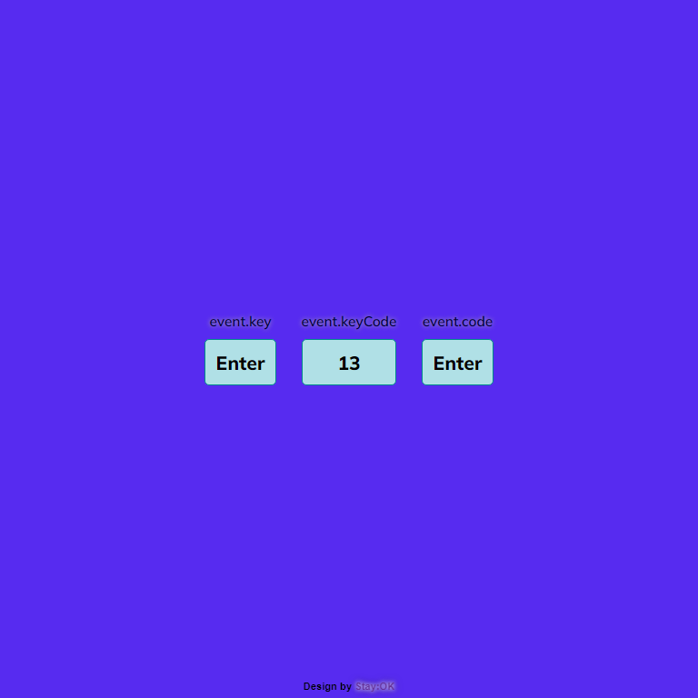

# Display Keycode Webapp

#### What has been implemented:

- elementary HTML and CSS design
- DOM manipulation: removing a starting element `
` and adding new objects to display _**event.key**_, _**event.keyCode**_ and _**event.code**_ using JavaScript
- the function `displayKeyCode()` is triggered when using the `keydown` event
- using pseudo selector **`::before`** to display image discription
- automatic changing of style atribute `background-color` when the function `displayKeyCode()` is triggered
- click here => [_**Display Keycode Webapp**_](https://bakna2t.github.io/keycode/)

---

<!--  -->

